---
{"dg-publish":true,"permalink":"/20-me/24-workflows/daily-notes/"}
---

# Daily Notes
---
I use daily notes to track my day-to-day progress in various fields. I also use them to keep track of what I'm doing and the things I learn each day.

## Flow

```mermaid
graph TD;
	A["🌄 Beginning of the day"] --> B
	B["Create the daily note 🗒️"] --> C
	C["Have a look at my tasks ✅"] --> D
	D["Fill in the note throughout the day"] --> E
	E["Review the note at the end of the day"]
```

###### META
Status:: #workflow
Related:: 
