---
{"dg-publish":true,"permalink":"/20-me/24-workflows/flashcards/"}
---

# Flashcards
---
I use flashcards to memorize information I learn from various sources. My flashcards software is [[Anki\|Anki]].

## Flow

```mermaid
graph TD;
	A["Retrieve 💧"] --> B["Extract important information to be memorized"] --> C["Add 🎴 to Anki"]
```

> [!INFO]
> See [[90 Meta/Vault Wiki\|Vault Wiki]] for the emoji reference

###### META
Status:: #workflow
Related:: 
