---
{"dg-publish":true,"permalink":"/20-me/24-workflows/gtd/"}
---

# GTD
---
[[Get Things Done\|Get Things Done]] is a way to manage tasks. I have my own adaptation of this system.

## Flow

```mermaid
graph TD;
	A["What are my 🗻?"]
	--> B["Divide 🗻 into 🚧"]
	--> C["Divide 🚧 into 🎯"]

	E["✅ idea"]
	E -->|"The ✅ is related to a project"|F["Capture to associated 🚧 or 🎯"]
	E -->|"The ✅ is independent"|G["Capture to 📥"]
```

> [!INFO]
> See [[90 Meta/Vault Wiki\|Vault Wiki]] for the emoji reference

###### META
Status:: #workflow
Related:: 
