---
{"dg-publish":true,"permalink":"/20-me/24-workflows/references/"}
---

# References
---
The references workflow is a bit strange for now. As there are various types of references, from quotes to courses to videos, I have to find a way to unify everything.

## Flow

```mermaid
graph TD;
	A["Found interesting content 📄"]
	A -->|"Is a 📗"|B["Add to GoodReads"]
	A -->|"Is a 🎞️"|C["Add to Letterboxd"]
	A -->|"📄 Other"|D["Add to 🌧️ Raindrop"]
	B --> E["Sync to the vault"]
	C --> E
	D --> E
	E --> F["Fulfill the 🖇️"]
	F --> G["Consume the content 📄"]
	G --> H["Update its status in the 🖇️"]
	H --> I["Eventually update its status on other platforms"]
```

> [!INFO]
> See [[90 Meta/Vault Wiki\|Vault Wiki]] for the emoji reference

###### META
Status:: #workflow
Related:: 
