---
{"dg-publish":true,"permalink":"/20-me/24-workflows/zk/"}
---

# ZK
---
I organize my notes in a [[Zettelkasten\|Zettelkasten]] style. I characterize my notes according to an [[10 Wiki/Status/Epistemic Status - 20230112085426\|Epistemic Status]] meaning my notes evolved over time.

## Flow

```mermaid
graph TD;
	A[Consume content]--> B[Take notes] & C["Create a 🖇️"]
	--> D["Interesting ideas may be turned into 🌱"]
	--> E["🌱 I want to keep are turned into 🌰"]
	--> F["With a lot of research and validation, 🌰 are turned into 🪴"]
	--> G["When reviewed and modified, 🪴 are turned into 💧"]
	--> H["💧 are then validated again and turned back into 🪴"]
	H --> G
	I["🌲 can be assigned at any moment"]
	J["Notes can be turned into 🍂 at any moment for various reasons"]
```

> [!INFO]
> See [[90 Meta/Vault Wiki\|Vault Wiki]] for the emoji reference

###### META
Status:: #workflow
Related:: 
