---
{"dg-publish":true,"permalink":"/20-me/workflows/daily-notes/"}
---

# Daily Logs
---
I use daily logs to track things I want to remember. I also use them to keep track of what I'm doing and the things I learn each day.

In Obsidian, there's just the part "raw data" of the daily logs. The rest is in Notion.

## Flow

```mermaid
graph TD;
	A["🌄 Beginning of the day"] --> B
	B["Create the daily log 🗒️"] --> D
	D["Fill in the note throughout the day"] --> E
	E["Review the note at the end of the day"]
```

###### META
Status:: #workflow
Related:: 
